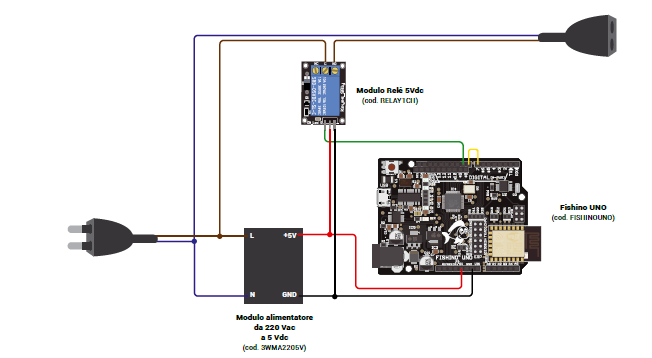

# Smart-Christmas


Questa è una piccola introduzione ad un controllo remoto per addobbi natalizi, basato su un Fishino Uno, IFTTT, AdafruitIO, Alexa e Google Assistant.

Tutte le informazioni sono presenti sulla rivista [ElettronicaIN #250](https://futuranet.it/prodotto/n-250-dicembre-2020-gennaio-2021/).

---

# Hardware

- Una scheda [Fishino UNO]([Fishino UNO Rev.2 basata sull&#039;ATmega328 di Arduino UNO](https://futuranet.it/prodotto/fishino-uno-rev-2-basata-sullatmega328-di-arduino-uno/)

- Un [modulo relè 5V](https://futuranet.it/prodotto/modulo-1-rele-5-vdc-10a-montato/)

- Un [trasformatore 220V AC - 5V DC](https://futuranet.it/prodotto/modulo-dc-dc-stepdown-5v-3a/)

- Cavo USB per il caricamento dello sketch

- Jumper vari

- Una scatola di plastica per l'elettronica

- Prolunga elettrica

## Schema di collegamento

> [!WARNING]  
> Presta attenzione! È pericoloso lavorare con la rete elettrica a 220V.



---

# Software

Lo schema logico è tale per cui:

* L'utente usa uno dei due assistenti vocali per chiedere l'accensione o lo spegnimento degli addobbi
* L'assistente vocale triggera un'azione di IFTTT corrispondente al comando vocale
* IFTTT triggera il server MQTT di Adafruit che invia un messaggio relativo all'accensione  o allo spegnimento degli addobbi
* Il Fishino riceve il comando e in base allo stato attuale degli addobbi, li accende o li spegne 

---

## Configurazione dei servizi in cloud

---

### Configurazione del server MQTT di Adafruit

Configura il servizio MQTT di [Adafruit](https://io.adafruit.com/) seguendo questa [guida](https://learn.adafruit.com/adafruit-io/arduino).

Ricorda che i feed avranno il nome del tipo `accendi-gli-addobbi-natalizi` e `spegni-gli-addobbi-natalizi`.

### Configurazione del servizio IFTTT

Configura il servizio [IFTTT](https://io.adafruit.com/) (If This Than That) usando le integrazioni per [Adafruit](https://ifttt.com/adafruit), [Alexa](https://ifttt.com/amazon_alexa/triggers/custom_utterance_uttered) e [Google Assistant](https://ifttt.com/google_assistant_v2).

----

## Lo sketch

```arduino
///////////////////////////////////////////////////////////////////////
//           CONFIGURATION DATA -- ADAPT TO YOUR NETWORK             //
//     CONFIGURAZIONE SKETCH -- ADATTARE ALLA PROPRIA RETE WiFi      //
#ifndef __MY_NETWORK_H

// OPERATION MODE :
// NORMAL (STATION)  -- NEEDS AN ACCESS POINT/ROUTER
// STANDALONE (AP)  -- BUILDS THE WIFI INFRASTRUCTURE ON FISHINO
// COMMENT OR UNCOMMENT FOLLOWING #define DEPENDING ON MODE YOU WANT
// MODO DI OPERAZIONE :
// NORMAL (STATION) -- HA BISOGNO DI UNA RETE WIFI ESISTENTE A CUI CONNETTERSI
// STANDALONE (AP)  -- REALIZZA UNA RETE WIFI SUL FISHINO
// COMMENTARE O DE-COMMENTARE LA #define SEGUENTE A SECONDA DELLA MODALITÀ RICHIESTA
//#define STANDALONE_MODE

// here put SSID of your network
// inserire qui lo SSID della rete WiFi
#define MY_SSID  ""

// here put PASSWORD of your network. Use "" if none
// inserire qui la PASSWORD della rete WiFi -- Usare "" se la rete non ￨ protetta
#define MY_PASS ""

// here put required IP address (and maybe gateway and netmask!) of your Fishino
// comment out this lines if you want AUTO IP (dhcp)
// NOTE : if you use auto IP you must find it somehow !
// inserire qui l'IP desiderato ed eventualmente gateway e netmask per il fishino
// commentare le linee sotto se si vuole l'IP automatico
// nota : se si utilizza l'IP automatico, occorre un metodo per trovarlo !
#define IPADDR  192, 168,   1, 125
#define GATEWAY 192, 168,   1, 1
#define NETMASK 255, 255, 255, 0

#endif
//                    END OF CONFIGURATION DATA                      //
//                       FINE CONFIGURAZIONE                         //
///////////////////////////////////////////////////////////////////////
```

Modifica lo sketch, definendo `MY_SSID` e `MY_PASS`, adattandole alla tua rete.

Puoi decidere se usare un IP statico (default) oppure usare il DHCP. Per abilitare il DHCP è sufficiente commentare le istruzioni `#define IPADDR`, `#define GATEWAY` e `#define NETMASK` , altrimenti usiamole per definire rispettivamente l'indirizzo IP del Fishino, quello del gateway e la netmask, rispettivamente.

```arduino
#define AIO_SERVER      "io.adafruit.com"
#define AIO_SERVERPORT  1883                   // usare la 8883 se si usa il Secure Sockets Layer (SSL)
#define AIO_USERNAME  ""
#define AIO_KEY       ""
```

Successivamente inserisci i vari parametri annotati precedentemente, serviranno per la connessione al server MQTT di Adafruit.

Flashato lo sketch, il sistema sarà operativo e in grado di accendere gli addobbi natalizi, usando sia Google Home sia Alexa.

---

Sentiti libero di editare lo sketch, di migliorarne le funzionalità e di inviare delle pull requests.

Il template del file README è stato preso da [qui](https://github.com/bremme/arduino-project/blob/master/README.md)
